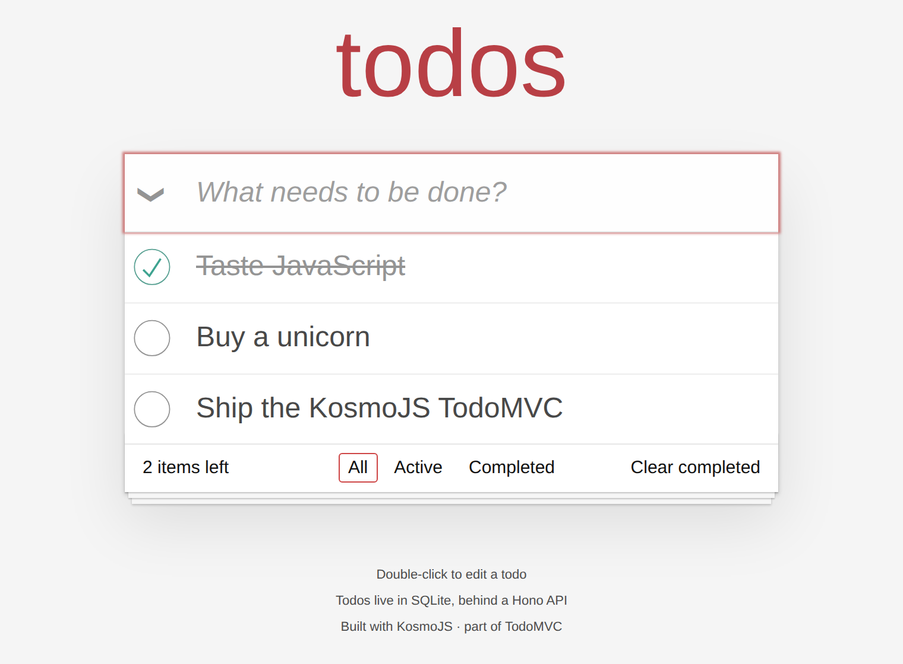

# TodoMVC · KosmoJS

The [TodoMVC](https://todomvc.com) application, built as a real full-stack app:
React pages, a Hono API, and todos that live in SQLite instead of `localStorage`.

It follows the [KosmoJS](https://kosmojs.dev) conventions throughout - directory-based
routing on both sides, runtime validation derived from TypeScript types, typed fetch
clients, and server-side rendering where the fetch never leaves the process.



## Quick start

```sh
pnpm install
pnpm dev          # http://localhost:4556
```

The dev server seeds any missing framework files on first start and then watches your
routes. It is always client-rendered - to see the server-rendered output, run the
production build:

```sh
pnpm preview      # builds, then serves dist/run.js on http://localhost:4558
```

| Command | What it does |
| --- | --- |
| `pnpm dev` | Dev server: Vite + HMR for pages, hot-reloaded API in the same process |
| `pnpm preview` | Production build, served the way production serves it |
| `pnpm build` | Production build into `dist/` |
| `pnpm typecheck` | `tsc` for the project root, then `kosmo typecheck` per source folder |
| `pnpm test` | Unit tests for the data layer (vitest) |
| `pnpm test:e2e` | End-to-end tests against the production build (Playwright) |

Requires **Node ≥ 22.5** for the built-in `node:sqlite` module (Node 22 prints an
experimental warning; on Node 24+ it is quiet). The database file defaults to
`data/todos.db` and can be pointed anywhere with `TODOMVC_DB`.

## How it is put together

One source folder, `src/app`, serving pages at `/` and its API at `/api`:

```txt
db/                        the database layer, shared through `@/db`
├── index.ts               connection, migration, teardown
└── todos.ts               the todo store

src/app/
├── kosmo.config.ts        React + Hono, SSR on, validation on, OpenAPI on
├── api/
│   ├── use.ts             global middleware: request id + request log
│   ├── errors.ts          the one place a failure becomes a response
│   └── todos/
│       ├── index.ts       GET · POST · PATCH · DELETE  ->  /api/todos
│       ├── types.ts       the contract: TodoT, NewTodoT, TodoPatchT
│       ├── title.ts       colocated helper, not a route
│       └── [id]/index.ts  PATCH · DELETE  ->  /api/todos/:id
├── pages/
│   ├── index/index.tsx    /            every todo
│   ├── active/index.tsx   /active      the active ones
│   ├── completed/…        /completed   the completed ones
│   └── 404.tsx            the router's catch-all
├── components/            TodoApp, TodoItem, the typed Link
└── hooks/useTodos.ts      todo state and the mutations behind it
```

### The data layer lives at the root

`db/` is not part of any source folder - it is imported as `@/db/todos` from anywhere,
which is how KosmoJS shares a database across folders without workspaces or packages.
Add a second source folder (an admin panel, say) and it talks to the same store.

The store is built over a *connection resolver* rather than a connection, because the
dev server restarts the API on every change; `api/dev.ts` closes the handle in its
`teardownHandler` so connections do not leak across reloads.

### The API is the contract

`api/todos/types.ts` is written once and drives four things at the same time: the
handler's compile-time types, the runtime validators, the typed fetch clients, and
`src/app/openapi.json`. There is no second schema to keep in sync.

```ts
export type TodoIdT = VRefine<number, { minimum: 1, multipleOf: 1 }>;
export type TodoTitleT = VRefine<string, { minLength: 1, maxLength: 255 }>;
```

| Route | Method | Payload | Answers |
| --- | --- | --- | --- |
| `/api/todos` | `GET` | – | `TodoT[]` |
| `/api/todos` | `POST` | `json: { title }` | `201` the created todo |
| `/api/todos` | `PATCH` | `json: { completed }` | the list, after marking all |
| `/api/todos` | `DELETE` | `query: ?completed=true` | the list, after clearing |
| `/api/todos/:id` | `PATCH` | `json: { title?, completed? }` | the updated todo |
| `/api/todos/:id` | `DELETE` | – | the removed todo |

Three details worth knowing:

- **`[id]` is refined to a positive integer**, so `/api/todos/1.5` is a 400 before the
  handler runs - a float would otherwise reach SQLite and fail there instead.
- **`?completed=true` is coerced to a boolean** - `query` is the one target that coerces
  both numbers and booleans. `headers`, `cookies` and `form` never do.
- **Handlers throw, they do not catch.** `throw new HTTPError([404, …])` reaches
  `api/errors.ts`, which is the single place that decides what a failure looks like on
  the wire.

Every handler declares a `response`, which is what gives the client a typed result
instead of `unknown`, and what puts the route in the OpenAPI spec.

### The pages

Each filter is a real page with its own loader:

```tsx
export const loader = () => GET();          // fetchClients["todos"].GET

export default function ActiveTodosPage() {
  const todos = useLoaderData<Array<TodoT>>();
  return <TodoApp filter="active" todos={todos} />;
}
```

The same call takes two transports: during SSR it dispatches into the Hono app
**in-process** - no socket, no localhost hop - and the result is reused on hydration; in
the browser it is an ordinary same-origin request. Nothing about the call site changes.

`useTodos` holds the list from there. Mutations paint their result immediately and fold
the server's answer in when it lands; if a request fails, the list rolls back to what the
server last confirmed and the error is shown rather than swallowed - fetch clients always
throw, so nothing fails quietly.

Filter links go through the typed `Link`: `to={["active"]}`. Rename a page folder and
every stale link becomes a compile error.

### What is derived, and what is yours

`lib/` is derived: route tables, validators, fetch clients, the TypeScript base config.
It is git-ignored except for the per-route derivation cache, so a fresh clone does not
pay for a full rebuild. You never edit it. `src/`, `db/` and `e2e/` are yours.

## Tests

- **`pnpm test`** - the store against a real in-memory SQLite: create/update/remove,
  the toggle-all change count, the `completed IN (0,1)` constraint.
- **`pnpm test:e2e`** - the TodoMVC behaviour itself, against the production build:
  adding, toggling, double-click editing (Enter commits, Escape cancels, an emptied
  title destroys), filtering by URL, toggle-all, clear-completed, persistence across a
  reload, an API error reaching the UI, and a 404 with a real 404 status.

The e2e suite runs against `dist/run.js` rather than the dev server, because server
rendering only happens in a production build.

## Decisions worth naming

- **`node:sqlite`, no dependency.** The store is ~100 lines of SQL against the built-in
  driver. Swapping in `better-sqlite3` would touch `db/index.ts` and nothing else.
- **`DELETE` answers with a body.** A `204` would be more RESTful, but the fetch client
  parses every response as JSON, so an empty body surfaces as a parse error. Returning
  the removed todo is both typed and useful.
- **No `<form>` around the new-todo field.** KosmoJS has no progressive-enhancement form
  post, so a native submit before hydration would navigate away and lose the todo.
  `Enter` on the input is the spec's gesture and needs no form.
- **Filters are routes, not state.** `/active` and `/completed` are server-rendered
  pages, so a shared link opens the list the sender was looking at.

## License

MIT
